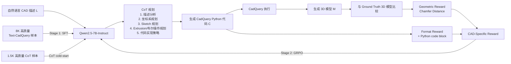

# CAD-Coder：Text-to-CAD Generation with Chain-of-Thought and Geometric Reward 阅读笔记

> **论文**：*CAD-Coder: Text-to-CAD Generation with Chain-of-Thought and Geometric Reward*  
> **会议**：NeurIPS 2025  
> **核心任务**：根据自然语言描述生成可执行的 CadQuery 脚本，并由脚本构建对应的 3D CAD 模型。  
> **一句话总结**：CAD-Coder 将 Text-to-CAD 从“预测低层 CAD 命令序列”改写为“生成可执行的 Python/CadQuery 程序”，再用 **SFT + CoT 冷启动 + GRPO 几何奖励**同时优化代码有效性与 3D 几何准确性。

---

## 1. Introduction

### 1.1 现有方法的主要局限

传统 Text-to-CAD 方法通常把 CAD 表示为预定义的 **command sequence**，再将任务视为“文本 → CAD 命令序列”的机器翻译问题。论文指出这类表示主要存在三点问题：

1. **有效性难验证**：命令序列本身不能方便地直接执行并验证最终 CAD 是否有效。
2. **操作类型受限**：多数方法主要支持 sketch、extrusion 等有限操作，限制了可生成模型的复杂度与多样性。
3. **可解释性与可编辑性弱**：低层、线性化命令难以理解和调试，也不利于后续修改。

此外，即使改用 LLM 生成 CadQuery，**仅靠 SFT 仍不够**：CAD 程序既要求语法正确，又要求最终 3D 几何正确；token-level 的监督并没有直接提供 3D 几何知识。更重要的是，**不同 CadQuery 程序可以生成几何上等价的模型**，因此用唯一代码作为监督目标并不完全适合 CAD 生成。

### 1.2 本文创新点

论文的核心创新可以概括为四点：

- **CadQuery 作为中间表示**：使用 Python-based parametric CAD language 替代低层命令序列。其代码可执行、可验证、操作丰富、语义更清晰，并能直接利用已有 LLM 的代码生成能力。
- **两阶段训练**：先用高质量文本–CadQuery 对进行 **SFT**，学习基本语法与“语言 → 建模操作”的映射；再使用 **GRPO** 强化学习直接优化生成模型的几何质量。
- **CoT + CAD-Specific Reward**：用 CoT 模拟工程建模规划过程；奖励同时包含 **Chamfer Distance 几何奖励**与**格式奖励**，兼顾几何正确性和可执行/结构化输出。
- **数据构建流水线**：自动构建 **110K text–CadQuery–3D triplets**，并进一步制作 **1.5K 高质量 CoT 样本**。

---

## 2. Method

### 2.1 方法总览

论文采用 Qwen2.5-7B-Instruct 作为基础模型。输入自然语言设计描述 \(L\)，模型生成 CadQuery 脚本 \(C\)，脚本执行后得到 3D 几何：

\[
M = Execute(C)
\]

整体训练流程为：**高质量数据 SFT → CoT 冷启动 → GRPO + CAD-specific reward**。

### 2.2 整体框架图（根据论文 Fig. 2 重绘）

**框架含义**：

- SFT 首先让模型“会写 CadQuery”；
- CoT 让模型在写代码前显式进行部件分解、坐标规划和建模操作规划；
- GRPO 不再只比较代码 token，而是实际执行代码并比较生成 3D 几何；
- 因而优化目标从“代码像不像 ground truth”转向“**最终模型是否可执行且几何接近目标**”。

---

### 2.3 为什么选择 CadQuery

CadQuery 是 Python 参数化 CAD 语言，可通过 `box()`、`circle()`、`extrude()` 等链式操作描述完整建模过程，并通过 OpenCascade 渲染为 3D 模型。

相较 DeepCAD 一类 sketch-extrusion command sequence，CadQuery 的关键优势是：

- **Executable**：脚本可直接执行，天然支持有效性验证；
- **Expressive**：包含更丰富的几何/布尔操作；
- **Interpretable / Editable**：函数级语义比低层命令更清晰；
- **LLM-friendly**：本质是 Python 代码，可直接利用代码大模型能力。

---

### 2.4 Stage 1：Supervised Fine-Tuning

SFT 使用数据构建流程得到的 **8K 高质量样本** \((L,C_{gt})\)。

训练目标是标准自回归语言建模：

\[
\mathcal{L}_{SFT} =
-\mathbb{E}_{(L,C_{gt})}
\left[
\sum_t \log \pi_\theta(c_t\mid c_{<t},L)
\right]
\]

这一阶段主要学习：

- CadQuery 基本语法；
- 文本描述与 CAD primitive 的映射，例如：
  - “create a hole” → `.hole()`
  - “draw a circle” → `.circle()`

**论文观察**：SFT 后模型可以处理标准、简单建模，但仍存在：
1. 生成几何与目标模型不够一致；
2. 对复杂、多步、空间推理任务表现较差。

因此需要第二阶段直接从 3D 几何结果提供监督。

---

### 2.5 CoT：先规划，再生成代码

CoT 样本要求模型在 `<think>...</think>` 中给出简洁的建模规划。论文重点包含：

- component decomposition；
- coordinate system assignment；
- sketch design；
- extrusion / modeling operation planning；
- code implementation strategy。

其作用不是改变最终 CAD 表示，而是让复杂 CAD 生成从“一步写代码”转为：

**文本理解 → 几何/坐标规划 → 部件与操作分解 → CadQuery 实现。**

论文构建了 **1.5K 高质量 CoT 样本**用于 reasoning cold-start。

---

### 2.6 Stage 2：GRPO + CAD-Specific Reward

对于同一个输入，当前策略一次采样 \(k\) 个 CadQuery candidate。论文实验中：

\[
k=8
\]

#### (1) Geometric Reward

每个候选代码先通过 CadQuery 执行：

- 无法执行 → 几何奖励为 0；
- 可执行 → 生成 mesh，采样 point cloud，与 ground-truth 计算 Chamfer Distance（CD）。

CD 越小，生成几何越接近目标。

论文使用分段奖励：

- \(CD < 10^{-5}\)：reward = 1.0；
- \(CD \ge 0.5\) 或代码执行失败：reward = 0；
- 中间区间：随 CD 增大线性下降；在 CD=0.5 附近最小非零奖励为 0.01。

**关键意义**：CAD 不存在唯一正确代码，因此不做 exact-code-match，而是直接奖励“**几何等价/接近**”的程序。

#### (2) Format Reward

通过正则检查输出是否同时包含：

- `<think>...</think>` reasoning block；
- 格式正确的 Python code block。

满足则 \(R_{fmt}=1\)，否则为 0。

最终：

\[
R_i = \lambda_{geo}R^{geo}_i+\lambda_{fmt}R^{fmt}_i
\]

论文再用该 reward 计算组内相对 advantage，并通过 GRPO 更新模型。

> 补充实验表明：**只使用 Chamfer Distance 会导致训练失败**。约 200 steps 后模型开始频繁生成无效 CadQuery，代码无法执行后 CD 也无法计算，RL 反馈链中断。因此 format / code supervision 对训练稳定性是必要的。

---

### 2.7 数据构建

原始 Text2CAD 含约 **178K 文本描述 + ground-truth 3D geometry**，但没有与几何严格对齐的 CadQuery 代码。

论文的数据流水线：

1. 取 Text2CAD 的 command sequence；
2. 用 **DeepSeek-V3** 生成多个 CadQuery candidate；
3. 执行候选代码，丢弃无法执行者；
4. 将可执行结果与 ground-truth 3D 模型计算 CD；
5. 保留 CD 最小的候选脚本。

最终获得 **110K 有效 triplets**：

| 子集 | 数量 | 几何质量条件 |
|---|---:|---|
| High-quality | 8K | \(CD_{gt}<10^{-4}\) |
| Medium-quality | 70K | \(CD_{gt}<10^{-3}\) |
| Hard cases | 32K | \(CD_{gt}>10^{-3}\) |

另外，从 hard cases 中进一步生成、筛选并人工修正得到 **1.5K CoT 样本**。

---

## 3. Results

### 3.1 实验设置

- **Base model**：Qwen2.5-7B-Instruct
- **Evaluation**：Text2CAD 官方 test split
- **Metrics**
  - Mean CD ↓：平均几何误差；
  - Median CD ↓：对 outlier 更稳健的典型几何误差；
  - IR.% ↓：生成 CadQuery 无法执行的比例。
- **SFT**
  - 3 epochs
  - batch size = 64
  - learning rate = \(1\times10^{-5}\)
  - AdamW
  - full-parameter fine-tuning + DeepSpeed ZeRO Stage 2
- **CoT cold-start**：1.5K CoT samples，2 epochs
- **GRPO**
  - 1 epoch
  - batch size = 384
  - 每个 prompt 采样 \(k=8\)
  - KL coefficient \(\beta=0.001\)
- **硬件**：8 × NVIDIA A800 80GB
  - SFT：约 7 h
  - GRPO：约 146 h

Baselines 包括 Text2CAD，以及直接 prompt 生成 CadQuery 的 Claude-3.7-sonnet、GPT-4o、DeepSeek-V3、Qwen2.5-72B、Qwen2.5-7B。

---

### 3.2 主结果

> 论文 Table 1；CD 数值按论文标注为 \(\times10^3\)，越低越好。

| Method | Mean CD ↓ | Median CD ↓ | IR.% ↓ |
|---|---:|---:|---:|
| Claude-3.7-sonnet | 186.53 | 134.16 | 47.03 |
| GPT-4o | 143.50 | 40.96 | 70.50 |
| DeepSeek-V3 | 186.69 | 107.57 | 51.96 |
| Qwen2.5-72B | 209.41 | 153.81 | 82.64 |
| Qwen2.5-7B | 202.35 | 169.86 | 98.83 |
| Text2CAD | 29.29 | 0.37 | 3.75 |
| **CAD-Coder (Ours)** | **6.54** | **0.17** | **1.45** |

### 3.3 精炼分析

**1）直接使用通用/代码 LLM 并不能解决 Text-to-CAD。**  
即使参数规模更大，多个 LLM baseline 的 IR 仍高达约 47%–99%，说明“会写 Python”不等于“会生成可执行且空间正确的 CAD”。

**2）几何反馈是性能跃升的关键。**  
Text2CAD 已明显优于直接 prompting 的 LLM，而 CAD-Coder 又将 Mean CD 从 29.29 降至 6.54。按表中数值计算，相对 Text2CAD：

- Mean CD 约下降 **77.7%**；
- Median CD 约下降 **54.1%**；
- IR 约下降 **61.3%**。

说明方法不仅提高几何一致性，也没有以牺牲代码可执行性为代价。

---

### 3.4 消融实验：各组件是否必要

| Training Strategy | Mean CD ↓ | Median CD ↓ | IR.% ↓ |
|---|---:|---:|---:|
| SFT | 74.55 | 0.33 | 5.33 |
| Ours w/o SFT | 76.20 | 0.95 | 5.33 |
| Ours w/o CoT | 17.34 | 0.20 | 4.95 |
| **Ours (Full)** | **6.54** | **0.17** | **1.45** |

结论非常清晰：

- **SFT 是基础**：去掉 SFT 后性能明显较差，说明模型需要先掌握稳定的 CadQuery 语法和基本映射。
- **GRPO / CAD reward 是主要几何提升来源**：从 SFT 的 Mean CD 74.55 到 w/o CoT 的 17.34，说明直接优化 3D 几何结果非常有效。
- **CoT 进一步强化复杂空间规划**：加入 CoT 后 Mean CD 从 17.34 降至 6.54，并进一步降低无效代码率。
- 三者关系更接近“**SFT 学会写 → CoT 学会规划 → GRPO 根据真实 3D 结果纠偏**”，而非可互相替代的模块。

---

### 3.5 数据质量消融

| SFT 数据 | Mean CD ↓ | Median CD ↓ | IR.% ↓ |
|---|---:|---:|---:|
| 70K medium-quality | 9.89 | 0.18 | 3.21 |
| **8K high-quality** | **6.54** | **0.17** | **1.45** |

论文据此强调 **quality outweighs quantity**：CAD 中微小的代码/参数不一致就可能造成明显几何误差，因此高精度监督比单纯增加数量更重要。

---

### 3.6 当前模型局限与失败案例

论文在正文和补充材料中给出了较明确的限制：

1. **不支持多模态输入**  
   当前只接收文本，不支持 image / point cloud，限制了真实设计场景中的使用范围。

2. **CoT 推理仍较浅**  
   对非常复杂的 spatial composition 仍可能失败，尤其是包含多个子组件时，模块间空间对齐不准确会产生错位。

3. **奖励监督粒度有限**  
   当前 reward 主要依赖 Chamfer Distance + format check，没有显式监督拓扑、部件关系、操作语义等更细粒度结构。

4. **操作类型可能判断错误**  
   补充实验显示模型可能混淆 extrusion、cutting 等操作，使最终结构偏离设计意图。

5. **CD 本身存在盲区**  
   对很薄的结构、内部空腔、重叠区域或严格几何公差，稀疏 point sampling 可能无法充分反映结构差异，甚至出现 **reward hacking**。

因此，CAD-Coder 的强项是“把几何结果真正纳入 LLM 训练闭环”，但它还没有解决精细拓扑/结构约束和极复杂空间推理问题。

---

## 4. Conclusion

### 4.1 论文得到的核心结果

CAD-Coder 证明了一条有效的 Text-to-CAD 路线：

> **用可执行 CAD 程序作为中间表示，并让强化学习直接根据最终 3D 几何质量给奖励。**

最终模型在 Text2CAD test split 上达到：

- **Mean CD：6.54**
- **Median CD：0.17**
- **Invalidity Ratio：1.45%**

均优于论文比较的 Text2CAD 和直接 prompting 的大模型。

从消融实验看，论文最重要的经验不是单一模块，而是三个阶段的互补：

**高质量 SFT → CoT 几何规划 → CAD-specific GRPO 几何纠偏。**

### 4.2 局限与后续方向

当前方法仍受限于：

- 仅文本输入，缺乏 image / point-cloud multimodal conditioning；
- CoT 对极复杂空间组合仍不足；
- CD + format reward 缺乏更细粒度的结构/拓扑监督；
- 薄壁、内部空腔、复杂部件对齐以及严格公差场景仍容易失败。

论文提出未来可进一步扩展 CAD operation 范围，并继续增强 LLM 的 planning / reasoning 以及更细致的几何监督。

---

## 最后抓重点

如果只记住这篇论文的 4 个关键词：

**CadQuery representation → High-quality SFT → CoT planning → GRPO with geometric reward**

其中最值得关注的思想是：**CAD 代码不是唯一答案，因此不应只奖励“代码匹配”，而应执行程序后直接奖励“几何结果是否正确”。**

---

## Reference

- Guan et al., *CAD-Coder: Text-to-CAD Generation with Chain-of-Thought and Geometric Reward*, NeurIPS 2025.
- NeurIPS paper page: https://papers.neurips.cc/paper_files/paper/2025/hash/564a224e88f2490f3c1deaae877d37e3-Abstract-Conference.html
- arXiv: https://arxiv.org/abs/2505.19713
