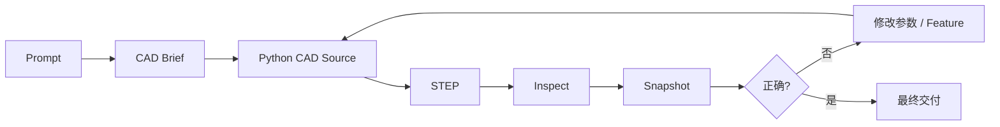

# text-to-cad 项目介绍

> GitHub：<https://github.com/earthtojake/text-to-cad>  
> 项目定位：面向 AI Agent 的 CAD、CAE、CAM 工程技能库  
> 重点：通过自然语言或参考图片生成、检查和迭代可工程化使用的 CAD 模型

---

## 一、项目总览：text-to-cad 是什么

`text-to-cad` 是一个面向 AI Agent 的工程技能库，目标不是单纯生成“看起来像 3D 模型”的网格，而是让 Claude Code、Codex 等 Agent 能够按照机械设计工作流，生成、修改、检查和交付真正可继续用于工程软件的 CAD 文件。

项目以 **STEP** 作为主要 CAD 产物，同时支持 STL、3MF、GLB 等二次导出，并围绕 CAD 建模提供 Viewer、几何检查、尺寸测量、装配定位、现成零件检索、DXF、G-code、机器人 URDF/SDF 等配套能力。

从整体上看，它解决的问题可以概括为：

> **把“自然语言设计需求”转换成“可参数化、可验证、可修改、可继续制造的 CAD 工程产物”。**

它最重要的特点，是没有让大模型直接生成 STEP 二进制文件，而是采用：

**自然语言 → CAD 设计意图 → 参数化 Python 源码 → BREP 几何 → STEP → 自动验证 → 视觉检查 → 迭代修复**

这种方式把大语言模型擅长的“理解、规划、编程”能力，与传统 CAD 几何内核擅长的“精确几何计算”结合起来。

---

# 二、项目主要能力

`text-to-cad` 并不是单一的 Text-to-CAD 模型，而是一组围绕工程设计任务组织起来的 Agent Skills。

目前主要能力包括：

| 模块 | 作用 |
|---|---|
| CAD | 根据自然语言、图片或工程图创建和修改参数化 CAD |
| CAD Viewer | 在浏览器中查看 CAD、机器人模型等工程文件 |
| step.parts | 查找螺钉、轴承、电机、连接器等现成 STEP 零件 |
| DXF | 创建二维轮廓、模板、切割图等 DXF 文件 |
| G-code | 将支持的模型切片为 FDM 3D 打印 G-code |
| Bambu Labs | 对 Bambu Lab 打印任务进行检查和交付 |
| URDF | 创建机器人 link、joint、limit、mesh 等描述 |
| SRDF | 创建 MoveIt2 规划组、末端执行器和碰撞配置 |
| SDF | 创建仿真模型和世界文件 |
| Implicit CAD | 使用 SDF/GLSL 方式进行实验性的隐式 CAD 建模 |

其中，整个项目最核心的能力仍然是 **CAD Skill**。

CAD Skill 的目标是创建：

> **valid STEP-ready BREP model，而不是 visual mesh。**

也就是说，生成结果首先是工程几何，其次才是可视化模型。

---

# 三、重点：CAD 是怎样生成出来的

## 3.1 整体流程

text-to-cad 的 CAD 生成流程可以概括为：

```mermaid
flowchart TD
    A[用户自然语言 / 图片 / 工程图] --> B[AI Agent 理解需求]
    B --> C[生成 CAD Brief]
    C --> D[提取尺寸、参数、Feature、Datum]
    D --> E[编写 build123d Python 源码]
    E --> F[执行 gen_step()]
    F --> G[build123d + Open Cascade]
    G --> H[生成 BREP]
    H --> I[输出 STEP]
    H --> J[生成 Topology / GLB]
    I --> K[几何检查与尺寸验证]
    J --> L[Viewer / Snapshot 视觉检查]
    K --> M{是否符合要求}
    L --> M
    M -- 否 --> N[修改 Python 参数或 Feature]
    N --> E
    M -- 是 --> O[交付 STEP / STL / 3MF / GLB]
```

这条链路中最关键的是：

> **LLM 主要负责生成“CAD 程序”，CAD 内核负责生成“精确几何”。**

---

## 3.2 第一步：理解自然语言需求

假设用户输入：

> 生成一块 100 mm × 60 mm × 6 mm 的安装板，四角各有一个直径 4.5 mm 的安装孔，孔中心距离相邻边 10 mm，中间开一个 20 mm × 12 mm 的矩形孔。

AI Agent 不会马上开始构造几何，而是首先把需求整理成一个内部的 **CAD Brief**。

CAD Brief 通常会明确：

- 模型是单个零件还是装配体；
- 使用什么单位；
- 整体尺寸；
- 坐标系和基准面；
- 需要哪些几何 Feature；
- 哪些尺寸是用户明确要求的；
- 哪些地方需要 Agent 做合理假设；
- 最终需要验证哪些尺寸和装配关系。

例如：

```text
Part:
    mounting_plate

Units:
    mm

Overall size:
    100 × 60 × 6

Features:
    - 4 × Ø4.5 through hole
    - 20 × 12 center cutout

Hole position:
    10 mm from adjacent edges

Validation:
    - width = 100
    - depth = 60
    - thickness = 6
    - hole diameter = 4.5
```

这一阶段的本质，是把自然语言转换成一个更接近机械设计语言的结构化描述。

---

## 3.3 第二步：把需求变成参数

text-to-cad 强调 **parameter-first** 的建模方式。

例如不会在代码里到处硬编码尺寸，而是先定义：

```python
width = 100.0
depth = 60.0
thickness = 6.0

hole_diameter = 4.5
hole_offset = 10.0

cutout_width = 20.0
cutout_depth = 12.0
```

这种方式的好处是，后续用户如果说：

> 把宽度改成 120 mm。

Agent 通常只需要修改：

```python
width = 120.0
```

而不是重新生成整个模型。

因此，text-to-cad 的生成结果并不是一次性的 3D 输出，而更接近：

> **CAD-as-Code**

即用源码保存设计意图。

---

## 3.4 第三步：确定 CAD 建模策略

在真正写几何代码之前，Agent 会决定零件应该如何构造。

对于机械零件，常见两类策略是：

### 截面驱动

```text
Sketch
  ↓
Extrude / Revolve / Sweep / Loft
  ↓
Solid
```

适合：

- 回转体；
- 管道；
- 截面规则零件；
- profile-driven parts。

### 基础实体 + Feature

```text
Base Solid
   ↓
Add Boss / Rib
   ↓
Cut Hole / Slot / Pocket
   ↓
Shell
   ↓
Fillet / Chamfer
```

适合：

- 支架；
- 安装板；
- 外壳；
- 夹具；
- 机械结构件。

项目特别强调 Feature 顺序。

推荐优先：

```text
基础实体
    ↓
大的增材 Feature
    ↓
减材 Feature
    ↓
Shell
    ↓
孔
    ↓
Fillet / Chamfer
```

这样可以降低布尔运算和圆角导致 BREP 失败的概率。

---

# 四、核心机制：Agent 生成 build123d Python

text-to-cad 默认采用：

```text
Prompt
   ↓
Python CAD Source
   ↓
STEP
```

而不是：

```text
Prompt
   ↓
STEP
```

生成的源码通常类似：

```text
mounting_plate.step.py
```

并提供：

```python
def gen_step():
    ...
    return shape
```


# 五、从 Python 到 STEP

生成源码之后，项目通过自己的生成工具运行：

```bash
python scripts/gen models/mounting_plate.step.py --write
```

内部逻辑可以理解为：

```text
scripts/gen
    ↓
cadgen
    ↓
读取 *.step.py
    ↓
调用 gen_step()
    ↓
build123d
    ↓
Open Cascade
    ↓
BREP
    ↓
STEP
```

这里有几个重要组件。

## build123d

`build123d` 是参数化 CAD Python 库，负责描述：

- Box；
- Cylinder；
- Sketch；
- Extrude；
- Revolve；
- Loft；
- Sweep；
- Boolean；
- Fillet；
- Chamfer；
- Assembly 等。

## Open Cascade

Open Cascade（OCCT）是真正进行精确几何计算的 CAD 内核。

它负责：

- BREP；
- 曲面；
- 边；
- 面；
- 布尔运算；
- 拓扑关系；
- STEP 交换等。

所以最终得到的是正规 CAD 几何，而不是一组三角形。

## cadgen

项目还使用自己的 `cadgen` runtime 管理：

- CAD artifact generation；
- STEP 输出；
- geometry validation；
- topology extraction；
- selector；
- mesh/render package；
- source hashing 等。

可以把三者的关系理解成：

```text
LLM / Agent
     │
     ▼
build123d Python
     │
     ▼
build123d
     │
     ▼
Open Cascade
     │
     ▼
BREP
     │
     ▼
cadgen
     │
     ├── STEP
     ├── topology
     ├── GLB
     └── validation data
```

---

# 六、为什么还要生成 Topology

生成 STEP 只是第一步。

AI Agent 后续还需要理解模型，例如：

> 哪一个面是顶面？

> 这个孔到边缘多远？

> 哪一个实体是 lid？

> base 和 lid 是否对齐？

因此 text-to-cad 会建立 CAD topology 信息，使实体、面、边可以被引用。

例如可能出现：

```text
#o1.2
#o1.2.f1
#f1
```

这样的 selector reference。

于是 AI 不再只是“看到一个 STEP 文件”，而能够：

- 找到具体面；
- 找到具体实体；
- 对面进行测量；
- 判断法向；
- 计算两个实体之间的位置关系；
- 进行装配验证。

可以把 STEP + topology 看成一个可供 Agent 查询的：

> **几何数据库。**

---

# 七、生成后不是直接交付，而是自动检查

这是 text-to-cad 与很多 Text-to-3D 项目最大的区别之一。

它不会认为：

```text
Python 成功执行
=
CAD 正确
```

生成完成以后还需要进行几何检查。

例如：

```bash
python scripts/inspect refs model.step \
    --facts \
    --planes \
    --positioning
```

Agent 可以获得：

- Bounding Box；
- Solid 数量；
- Face 数量；
- Label；
- Plane；
- Position；
- Selector 等信息。

之后还可以执行：

```bash
python scripts/inspect validate model.step
```

验证内容包括：

- invalid topology；
- open shell；
- self intersection；
- non-positive volume；
- no solid；
- BREP 是否有效。

因此整个系统实际上具有：

> **CAD 单元测试**

的思想。

---

# 八、用户要求的尺寸还要重新测量

例如用户明确要求：

```text
板宽 = 100 mm
板厚 = 6 mm
孔径 = 4.5 mm
```

即使 Python 代码里面写的是：

```python
width = 100
```

也不意味着最终模型一定正确。

因此项目还支持对最终 STEP 进行重新测量：

```text
STEP
 ↓
inspect measure
 ↓
实际几何值
 ↓
与 CAD Brief 对比
```

这样可以检查：

```text
设计参数
    vs
最终 BREP
```

是否一致。

这相当于传统软件工程中的：

```text
Expected
   vs
Actual
```

测试机制。

---

# 九、还需要进行视觉检查

数字正确，也不代表设计一定正确。

例如一个支架可能：

- 长宽高正确；
- 孔径正确；
- Bounding Box 正确；

但支臂方向可能完全反了。

因此 text-to-cad 还提供：

```bash
python scripts/snapshot ...
```

为 CAD 创建 PNG / GIF 快照。

Agent 可以进一步检查：

- 外形是否符合设计意图；
- 孔是否打在正确位置；
- 零件方向是否正确；
- 装配是否明显穿插；
- 内部结构是否合理。

因此项目采用的是：

```text
几何确定性检查
       +
视觉语义检查
```

的双重验证方式。

---

# 十、发现错误后如何修改

如果验证发现问题，text-to-cad 不推荐直接修改生成出来的 STEP。

正确方式是：

```text
发现问题
   ↓
找到对应 Feature
   ↓
修改 *.step.py
   ↓
重新运行 gen_step()
   ↓
重新生成 STEP
   ↓
重新 Inspect
   ↓
重新 Snapshot
```

形成一个完整反馈闭环：



这个设计非常像程序开发中的：

```text
Write Code
   ↓
Compile
   ↓
Test
   ↓
Debug
   ↓
Compile Again
```

只是这里编译出来的不是软件，而是 CAD。

---

# 十一、装配体是怎样生成的

对于装配任务，例如：

> 设计一个电子设备外壳，包括 base 和 lid，并保证安装孔对齐。

项目推荐把不同制造零件分别建模，再形成 Assembly。

例如：

```python
from cadgen.assembly import AssemblyHelper

asm = AssemblyHelper("electronics_enclosure")

base = asm.add(
    make_base(),
    "base"
)

lid = asm.add(
    make_lid(),
    "lid"
)
```

装配体还会考虑：

- 零件 label；
- Local Coordinate System；
- Joint；
- Mate；
- Datum；
- Transform；
- Axis；
- Face alignment。

之后可以检查：

```text
base.top_face
      ↕
lid.bottom_face
```

或者：

```text
boss.axis
     ↕
hole.axis
```

这样 Agent 不只是生成几个重叠的 Solid，而是在表达真正的：

> **装配关系。**

---

# 十二、现成零件不会全部重新画

机械设计中经常需要使用：

- 电机；
- Servo；
- Bearing；
- Screw；
- Connector；
- Electronics board。

如果用户说：

> 为 NEMA17 电机设计安装支架。

text-to-cad 推荐首先使用 `step.parts` 查找真实的现成 STEP 模型，而不是让 AI 自己随便画一个近似电机。

流程可能变成：

```text
用户需求
   │
   ├── 自定义 bracket
   │       ↓
   │   build123d
   │       ↓
   │   bracket.step
   │
   └── NEMA17
           ↓
       step.parts
           ↓
       motor.step

           ↓

       Assembly

           ↓

     完整装配 STEP
```

这让 Agent 更接近真实机械工程师的工作方式。

---

# 十三、为什么项目坚持 STEP-first

text-to-cad 明确把 STEP 作为主要 CAD artifact。

原因是 STEP 保存的是精确工程几何。

## STEP

```text
BREP
 ├── Solid
 ├── Face
 ├── Edge
 ├── Plane
 ├── Cylinder
 ├── Curve
 └── Assembly
```

例如一个圆柱，在 STEP 中仍然可以被识别为：

```text
Cylinder
Radius = 5 mm
```

而 STL 主要保存：

```text
Triangle
Triangle
Triangle
Triangle
...
```

圆柱最终只是由大量小三角形近似出来。

因此：

| 能力 | STEP | STL |
|---|---:|---:|
| 精确曲面 | ✅ | ❌ |
| BREP | ✅ | ❌ |
| 面/边拓扑 | ✅ | ❌ |
| 精确测量 | ✅ | 有限 |
| Assembly | ✅ | ❌ |
| CAD 再编辑 | ✅ | 较弱 |
| 3D 打印 | 可转换 | ✅ |

所以 text-to-cad 追求的不是：

> “生成一个看起来像机械零件的模型。”

而是：

> **“生成一个能够继续进入真实工程工作流的 CAD 模型。”**

---

# 十四、项目的技术架构

整体可以分成四层。

## 第一层：AI Agent

负责：

- 理解自然语言；
- 理解图片；
- 提取尺寸；
- 做设计决策；
- 生成和修改 Python；
- 根据验证结果迭代。

典型使用者包括：

```text
Claude Code
Codex
其他支持 Agent Skills 的 Coding Agent
```

---

## 第二层：Agent Skills

Skill 相当于提供给 AI 的工程操作手册。

它告诉 Agent：

- CAD 应该怎样建模；
- 参数如何组织；
- 什么时候创建 Assembly；
- 怎样选择坐标系；
- STEP 如何生成；
- 如何进行 Inspect；
- 如何进行 Snapshot；
- 出错以后怎么修改。

因此 Skill 本质上是在给 AI 增加：

> **机械 CAD 工程方法论。**

---

## 第三层：CAD 几何系统

```text
build123d
    ↓
Open Cascade
```

负责真正的精确几何计算。

AI 不负责计算：

```text
两个复杂 BREP 的布尔交集
```

这些任务仍然交给成熟的 CAD kernel。

---

## 第四层：验证与交付

包括：

```text
cadgen
scripts/gen
scripts/inspect
scripts/snapshot
CAD Viewer
scripts/export
```

负责：

- 生成；
- 检查；
- 测量；
- 渲染；
- 导出；
- 最终交付。

完整架构可以表示为：

```text
                User
                  │
                  ▼
            Natural Language
                  │
                  ▼
           AI Coding Agent
                  │
                  ▼
              CAD Skill
                  │
                  ▼
              CAD Brief
                  │
                  ▼
         build123d Python
                  │
                  ▼
          build123d + OCCT
                  │
                  ▼
                BREP
                  │
          ┌───────┴────────┐
          ▼                ▼
        STEP           Topology / GLB
          │                │
          ▼                ▼
       Inspect           Viewer
          │                │
          └───────┬────────┘
                  ▼
              Snapshot
                  │
                  ▼
            Agent Review
                  │
             ┌────┴────┐
             │         │
            Pass      Fail
             │         │
             ▼         ▼
          Delivery   Edit Source
                       │
                       └──────↺
```

---

# 十五、与传统 AI Text-to-3D 的区别

很多 AI 3D 项目的主要流程是：

```text
Prompt
   ↓
Generative Model
   ↓
Mesh
```

重点是：

> **视觉上像不像。**

而 text-to-cad 的重点是：

```text
Prompt
   ↓
Engineering Intent
   ↓
Parameters
   ↓
CAD Source
   ↓
BREP
   ↓
STEP
   ↓
Measurement
   ↓
Validation
```

重点是：

> **工程上对不对。**

因此两种方法的目标并不完全相同。

| Text-to-3D | text-to-cad |
|---|---|
| 更关注视觉 | 更关注工程几何 |
| 常生成 Mesh | 生成 BREP / STEP |
| 修改困难 | 参数化源码可修改 |
| 尺寸未必准确 | 可以验证尺寸 |
| 缺乏拓扑语义 | 有 Face / Edge / Solid |
| 偏 CG / 内容生成 | 偏机械工程 |

---

# 十六、项目最大的价值

text-to-cad 最有价值的地方，不一定是“第一次就能生成非常复杂的 CAD”，而是它定义了一套 AI 参与机械设计的可靠工作模式。

核心思想可以总结为四点：

### 1. 可解释

CAD 是由 Python 源码生成的，可以看到模型为什么是这样构造的。

### 2. 可修改

尺寸和 Feature 参数化以后，可以直接修改设计。

### 3. 可验证

最终 STEP 可以被机器重新测量和验证。

### 4. 可迭代

Agent 可以根据 Inspect 和 Snapshot 的结果不断修复模型。

因此整个系统形成：

```text
理解
 ↓
设计
 ↓
生成
 ↓
验证
 ↓
反馈
 ↓
修改
 ↓
再次生成
```

的闭环。

---

# 十七、适合的应用场景

text-to-cad 特别适合结构规则、尺寸明确的机械设计任务，例如：

- mounting bracket；
- electronics enclosure；
- adapter；
- fixture；
- plate；
- spacer；
- standoff；
- clamp；
- housing；
- robot link；
- motor mount；
- sensor mount；
- 3D printing functional parts。

例如：

```text
“做一个树莓派安装底板”
```

或者：

```text
“为 NEMA17 电机设计一个 L 型支架，
底板厚 5 mm，四个 M3 安装孔，
支架高度 60 mm。”
```

这种需求非常适合：

```text
Prompt
 → Parameters
 → build123d
 → STEP
```

的路线。

相对而言，对于人物、汽车外壳、雕塑、复杂自由曲面等以造型为主的任务，传统 AI 3D 或专门的曲面建模方法可能更加合适。

---

# 十八、总结

总体来看，`text-to-cad` 并不是简单意义上的“文本生成 CAD 模型”。

它更像是一个：

> **让 AI Agent 学会执行机械 CAD 工作流的工程框架。**

它采用的核心路线是：

```text
自然语言
   ↓
CAD Brief
   ↓
参数化设计
   ↓
build123d Python
   ↓
Open Cascade BREP
   ↓
STEP
   ↓
几何检查
   ↓
尺寸验证
   ↓
视觉检查
   ↓
迭代修改
   ↓
最终工程 CAD
```

整个项目最值得借鉴的架构思想可以用一句话概括：

> **它没有尝试让大模型取代 CAD 几何内核，而是让大模型学会“使用 CAD 几何内核”。**

也就是说：

- **LLM 负责理解、设计和编程；**
- **build123d 负责参数化建模；**
- **Open Cascade 负责精确几何；**
- **cadgen 和 inspect 负责验证；**
- **Viewer / Snapshot 负责视觉反馈；**
- **STEP 负责进入后续真实工程流程。**

因此，text-to-cad 展示的是一种很有代表性的 AI Engineering Agent 路线：

> **LLM + Domain Skill + Deterministic Tool + Verification Loop**

这套模式并不只适用于 CAD，同样可以扩展到 CAE、CAM、机器人、EDA 等要求高精度和可验证性的工程领域。

---

# 参考资料

- GitHub Repository  
  <https://github.com/earthtojake/text-to-cad>

- CAD Skill  
  <https://github.com/earthtojake/text-to-cad/blob/main/skills/cad/SKILL.md>

- build123d Modeling Patterns  
  <https://github.com/earthtojake/text-to-cad/blob/main/skills/cad/references/build123d-modeling.md>

- 项目官网  
  <https://www.texttocad.dev/>

---

*本文根据 `text-to-cad` 项目公开仓库整理，重点关注其 CAD 生成、参数化建模和自动验证工作流。*
